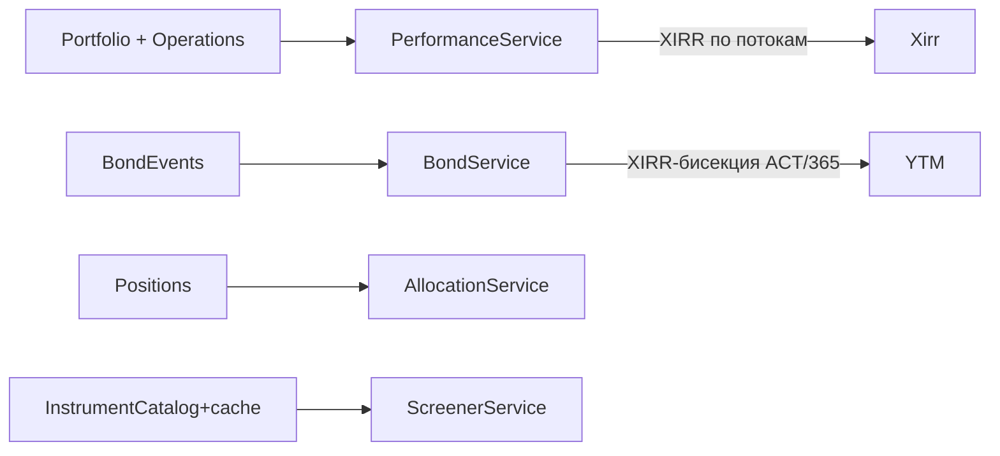

# EPIC-agent-financial-math: Финансовая аналитика на своей стороне (XIRR, YTM, allocation, screeners)

## 0. Простое описание (Human Brief)

### Проблема простыми словами (Problem)
- У нас нет собственных расчётов, которые T-Invest API не отдаёт готовыми: реальной доходности счёта (XIRR), доходности и дюрации облигаций (YTM), структуры портфеля (allocation), скринеров по всему каталогу.
- Без XIRR пользователь не понимает, сколько реально заработал с учётом пополнений/выводов. Без YTM нельзя сравнивать облигации. Без allocation — не видит диверсификацию.
- У конкурента это «из коробки»; у нас — крупный пробел.

### Варианты или путь решения (Solution Sketch)
- `performance` — XIRR доходности счёта по денежным потокам (с корректным выбором корня при чередовании вводов/выводов), вложено/выведено, чистый результат, див/купоны/комиссии/налоги.
- `bond` — YTM к погашению/оферте + дюрация Маколея (XIRR-бисекция, ACT/365), честный `null` + причина для флоатеров/амортизации/бессрочных.
- `allocation` — структура (классы/сектора/валюты/страны/концентрация).
- `screen bonds` / `screen shares` — скринеры по каталогу с локальным кэшем.
- `income` — календарь пассивного дохода (купоны+див на год).

### Ожидаемый результат (Expected Result)
- Пользователь видит реальную доходность счёта, может сравнивать облигации по YTM, видит структуру портфеля и концентрацию, запускает скринеры.
- Расчёты честные: нет данных — возвращаем `null` с причиной, не ноль и не фейк.

## 1. Concept and Goal (Концепция и цель)

### Story (User Story)
> Как инвестор, я хочу видеть реальную доходность счёта и корректно сравнивать инструменты, чтобы принимать решения по цифрам, а не по «P/L позиции».

### Goal (Цель по SMART)
Реализовать в `t-invest-core` финансовую математику (XIRR, YTM, дюрация, allocation, screeners, income) как сервисы и CLI-команды. Срок: спринт 2 (2–3 недели). Критерий: XIRR счёта совпадает с эталонным расчётом на тестовых потоках; YTM облигации совпадает с ручным расчётом на тестовом купонном графике.

## 2. Context and Scope (Контекст и границы)

- **Где делаем:** `t-invest-core/src/Service/{Performance,Bond,Allocation,Screener,Income}` + `src/Command/...`, локальный кэш в `t-invest-core`.
- **Границы (Out of Scope):**
    - Налоговая оптимизация, сложные деривативы.
    - Конвертация валют в одну базовую — только при наличии курсов API.
    - Опционные расчёты (греки, IV).

## 3. Requirements (Требования, MoSCoW)

### 🔴 Must Have (Блокирующие требования)
- [ ] `performance` — XIRR по денежным потокам с выбором корня.
- [ ] `bond` — YTM/доходность к оферте + дюрация Маколея (XIRR-бисекция, ACT/365).
- [ ] `allocation` — классы/сектора/валюты/страны/концентрация.
- [ ] `screen bonds` / `screen shares` — скринеры по каталогу.
- [ ] Локальный кэш каталога (сутки) и купонов (неделя).

### 🟡 Should Have (Важные требования)
- [ ] `income` — календарь пассивного дохода на год с итогами по месяцам.
- [ ] Честный `null` + причина для флоатеров/амортизации/бессрочных облигаций.

### 🟢 Could Have (Желательно)
- [ ] Предупреждения в `allocation` при мультивалютности/концентрации.

### ⚫ Won't Have (Не в этот раз)
- [ ] Опционы, греки, IV.
- [ ] Налоговые расчёты.

## 4. Solution Design (Техническое решение)

## 5. Implementation Plan (План реализации)

- [ ] TASK-agent-performance-xirr — XIRR доходности счёта
- [ ] TASK-agent-bond-ytm-duration — YTM и дюрация облигаций
- [ ] TASK-agent-allocation — структура портфеля
- [ ] TASK-agent-screener-bonds — скринер облигаций с кэшем
- [ ] TASK-agent-screener-shares — скринер акций (префы исключены)
- [ ] TASK-agent-income-calendar — календарь пассивного дохода
- [ ] TASK-agent-instrument-cache — локальный кэш каталога/купонов

## 6. Definition of Done (Критерии приёмки эпика)

- [ ] Все Must Have выполнены, unit-тесты на XIRR/YTM/дюрацию с эталонными значениями.
- [ ] XIRR корректно выбирает корень при чередовании вводов/выводов.
- [ ] YTM для флоатеров/амортизации/бессрочных = `null` + причина в `warnings`.
- [ ] Скринеры после первого прогона работают за доли секунды (кэш).
- [ ] `composer test`, `composer stan` зелёные.

## 7. Release Notes and Deployment (Инструкция по релизу)

- [ ] Обновить `skills/tinvest/SKILL.md` таблицей новых команд.
- [ ] Добавить раздел `references/json-fields.md` с ловушками полей (по образцу конкурента).
- [ ] bump `t-invest-core` minor.

## 8. Risks and Dependencies (Риски и зависимости)

- Корректность XIRR-бисекции на сложных графиках — нужны юнит-тесты с эталонами.
- Кэш может устареть — документировать TTL и возможность ручного сброса.

## 9. Sources (Источники)

- [ ] Конкурентный анализ: [`docs/COMPETITOR-ANALYSIS-t-invest-skill.md`](../docs/COMPETITOR-ANALYSIS-t-invest-skill.md)
- [ ] Эталон: https://github.com/nyxandro/t-invest-skill (`src/analytics/xirr.ts`, `src/commands/bond-math.ts`)

## 10. Comments (Комментарии)

Эпик соответствует «Спринту 2 — Аналитика вглубь».

## Change History (История изменений)

| Дата | Автор (роль) | Изменение |
| :--- | :--- | :--- |
| 2026-07-04 | Владелец проекта (pi) | Создание эпика |
