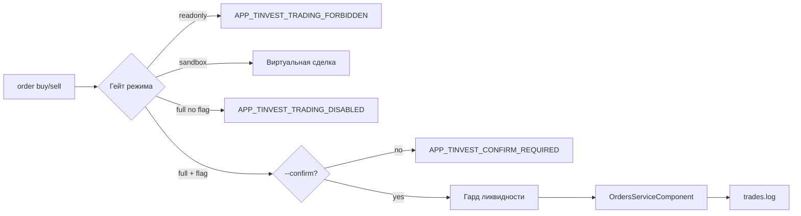

# EPIC-agent-safe-trading-cli: Безопасная торговля и режимы доступа к счёту

## 0. Простое описание (Human Brief)

### Проблема простыми словами (Problem)
- Сейчас у нас есть код `OrdersService` в `t-invest-core` (DTO, мапперы), но **нет ни одной CLI-команды** для выставления заявок — торговать нельзя.
- Нет защиты реальных денег: единственного режима, гейтов торговли, подтверждения сделки, идемпотентности, аудита.
- У нас один токен на всё, без различения «песочница / только чтение / полный доступ».
- У конкурента (`nyxandro/t-invest-skill`) этот слой — эталонный; у нас это крупнейший пробел (оценка безопасности 2/10).

### Варианты или путь решения (Solution Sketch)
- Перенять модель режимов/токенов конкурента (адаптировав под PHP/Symfony): 3 режима `sandbox`/`readonly`/`full`, каждый под своим токеном.
- Гейт реальных сделок в окружении (`T_INVEST_ALLOW_TRADING`), обязательное `--confirm` на каждую заявку, опасный `STONKS_MODE`.
- Идемпотентность через `--order-id` (UUID), гард ликвидности (проверка стакана/спреда), аудит-журнал `trades.log`.
- Персистентная «сессия режима» (`session start/status/end`), выбор режима в начале диалога.
- Поверх `OrdersService` выпустить CLI: `order preview/buy/sell/list/status/cancel/replace`, `stop-order set/list/cancel`, `sandbox init`.

### Ожидаемый результат (Expected Result)
- Пользователь может безопасно торговать из агента: песочница свободно, боевой счёт — только с флагом и подтверждением каждой сделки.
- Ошибки понятные, на русском, со стабильными кодами `APP_TINVEST_...`.
- Нельзя случайно потерять деньги: повтор после сбоя не дублирует заявку (идемпотентность), неликвид блокируется, все мутации пишутся в аудит.

## 1. Concept and Goal (Концепция и цель)

### Story (User Story)
> Как инвестор, я хочу торговать через AI-агента с гарантией, что случайная команда или сбой не потеряет мои деньги, чтобы доверять автономной работе со счётом.

### Goal (Цель по SMART)
Реализовать в `t-invest-core` безопасный торговый слой (3 режима + гейты + аудит) и полный торговый CLI (`order`, `stop-order`, `sandbox`, `session`) поверх существующего `OrdersService`. Критерий: рыночная/лимитная заявка в `sandbox` проходит за один вызов; в `readonly` запрещена с кодом `APP_TINVEST_TRADING_FORBIDDEN`; в `full` без флага — `APP_TINVEST_TRADING_DISABLED`; в `full` с флагом требует `--confirm`. Срок: спринт 1 (2–3 недели).

## 2. Context and Scope (Контекст и границы)

- **Где делаем:** `t-invest-core` (новые сервисы и команды), `t-invest-agent/skills/tinvest/SKILL.md` (дисциплина режимов).
- **Текущее поведение:** `OrdersServiceComponent` реализован, но CLI-команд нет; режимов и гейтов нет; один токен `TINKOFF_TOKEN`.
- **Границы (Out of Scope):**
    - Вывод/перевод средств — НЕ реализуем (токен уровня «Торговля», без «переводы»).
    - Автономная торговля по расписанию без пользователя — только через `STONKS_MODE` как осознанный opt-in.
    - Опционы, маржинальные сделки — вне эпика.

## 3. Requirements (Требования, MoSCoW)

### 🔴 Must Have (Блокирующие требования)
- [ ] 3 режима/токена: `sandbox`/`readonly`/`full`.
- [ ] Гейт реальных сделок в env (`T_INVEST_ALLOW_TRADING`), `--confirm` на каждую заявку, `STONKS_MODE`.
- [ ] Идемпотентность `--order-id` (UUID), аудит-журнал `trades.log`.
- [ ] Гард ликвидности: проверка стакана/спреда перед market-ордером.
- [ ] CLI: `order preview/buy/sell/list/status/cancel/replace`.
- [ ] CLI: `stop-order set/list/cancel`.
- [ ] CLI: `sandbox init`, `session start/status/end`.
- [ ] Русские коды ошибок `APP_TINVEST_...`, человекочитаемые сообщения.
- [ ] Обновить `skills/tinvest/SKILL.md` дисциплиной режимов и торговой дисциплиной.

### 🟡 Should Have (Важные требования)
- [ ] `-q` = ЛОТЫ с пересчётом «штук» → лотов и явным проговариванием.
- [ ] Печать ключа идемпотентности в stderr ДО отправки заявки.
- [ ] Баннер «Режим песочницы»/«stonks-режим» в stderr.

### 🟢 Could Have (Желательно)
- [ ] `TINVEST_SESSION_ID` для параллельных агентов.

### ⚫ Won't Have (Не в этот раз)
- [ ] Вывод/перевод средств.
- [ ] Автономная торговля по расписанию (кроме STONKS_MODE).
- [ ] Опционы.

## 4. Solution Design (Техническое решение)

Архитектурно: новый `TradingGate`/`Session` сервис в `t-invest-core/src/Service/`, обёртка над `OrdersServiceComponent`; команды в `src/Command/Trading/` и `src/Command/Session/`.

## 5. Implementation Plan (План реализации)

- [ ] TASK-agent-modes-and-tokens — режимы и 3 токена
- [ ] TASK-agent-trading-gate — гейт реальных сделок + `--confirm` + STONKS
- [ ] TASK-agent-idempotency-and-audit — `--order-id` + аудит-журнал
- [ ] TASK-agent-liquidity-guard — гард ликвидности (стакан/спред)
- [ ] TASK-agent-order-cli — команды `order preview/buy/sell/list/status/cancel/replace`
- [ ] TASK-agent-stop-order-cli — команды `stop-order set/list/cancel`
- [ ] TASK-agent-sandbox-and-session-cli — `sandbox init`, `session start/status/end`
- [ ] TASK-agent-trading-skill-discipline — обновить `skills/tinvest/SKILL.md`

## 6. Definition of Done (Критерии приёмки эпика)

- [ ] Все Must Have задачи выполнены и протестированы (unit + integration в sandbox).
- [ ] Сквозной сценарий: `session start --mode sandbox` → `sandbox init` → `order buy SBER -q 1 --confirm` → запись в `trades.log`.
- [ ] Все пути отказа (`readonly`/`full` без флага/без `--confirm`) возвращают корректные коды `APP_TINVEST_...`.
- [ ] `SKILL.md` описывает дисциплину режимов и подтверждения сделок.
- [ ] `php vendor/bin/todo-md-validate` проходит; `composer test`, `composer stan` зелёные.

## 7. Release Notes and Deployment (Инструкция по релизу)

- [ ] Документировать новые env-переменные в `.env.example` (`T_INVEST_TOKEN_SANDBOX/READONLY/FULL`, `T_INVEST_ALLOW_TRADING`, `T_INVEST_STONKS_MODE`).
- [ ] Обновить `README.md` раздел «Токены и режимы».
- [ ] bump `t-invest-core` minor; `composer update` в агенте.

## 8. Risks and Dependencies (Риски и зависимости)

- Поведение T-Invest API в sandbox может отличаться от боевого — нужна сверка полей ответа.
- Идемпотентность на стороне API может иметь TTL — документировать поведение при повторе.
- Безопасность: гейт в env = «защита штатных путей», не криптография; явно отразить в дисклеймере.

## 9. Sources (Источники)

- [ ] Конкурентный анализ: [`docs/COMPETITOR-ANALYSIS-t-invest-skill.md`](../docs/COMPETITOR-ANALYSIS-t-invest-skill.md) — разделы «Безопасность», «Торговый CLI».
- [ ] Репозиторий-эталон: https://github.com/nyxandro/t-invest-skill
- [ ] T-Invest API: https://developer.tbank.ru/invest/api

## 10. Comments (Комментарии)

Эпик соответствует «Спринту 1 — Деньги под защитой» из плана конкурентного анализа.

## Change History (История изменений)

| Дата | Автор (роль) | Изменение |
| :--- | :--- | :--- |
| 2026-07-04 | Владелец проекта (pi) | Создание эпика |
