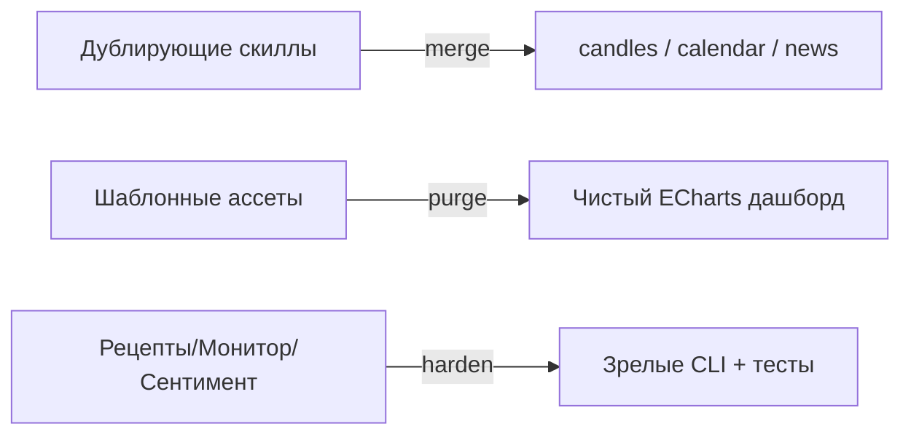

# EPIC-agent-cleanup-and-strengths: Очистка от шума и усиление отличительных фич

## 0. Простое описание (Human Brief)

### Проблема простыми словами (Problem)
- В репозитории много шума: дублирующие скиллы (2× candles, 2× calendar, news-rss + news-web), сотни шаблонных картинок брендов в дашборде (Phoenix), docs-«наброски» как пользовательская документация.
- Наши сильные стороны (рецепты, мониторинг, соц. настроения, дашборд) — сыроваты; их нужно довести до зрелых CLI-команд с тестами и `SKILL.md`.

### Варианты или путь решения (Solution Sketch)
- Склеить дублирующие скиллы в единые (candles, calendar, news) с выбором провайдера.
- Вырезать шаблонный мусор из дашборда, оставить чистый ECharts.
- docs разделить на «пользоваться» и «internal/идеи».
- Рецепты/мониторинг/соц. настроения довести до зрелых CLI с тестами.

### Ожидаемый результат (Expected Result)
- Меньше путаницы у агента (одна команда на задачу), меньше вес репо.
- Наши сильные стороны доведены до уровня конкурента по качеству.

## 1. Concept and Goal (Концепция и цель)

### Story (User Story)
> Как разработчик и пользователь, я хочу чистый проект без дублей и мусора и доведённые до ума фирменные фичи, чтобы агент не путался и продукт был зрелым.

### Goal (Цель по SMART)
Удалить/слить дублирующие скиллы и шаблонный мусор; довести рецепты/мониторинг/соц. настроения до зрелых CLI-команд с тестами и SKILL.md. Срок: спринт 4 (2 недели).

## 2. Context and Scope (Контекст и границы)

- **Где делаем:** `t-invest-agent/skills/`, `t-invest-agent/docs/`, продуктовые скиллы.
- **Границы (Out of Scope):**
    - Не ломать публичные контракты существующих команд.
    - Дашборд — только чистка ассетов, не редизайн.

## 3. Requirements (Требования, MoSCoW)

### 🔴 Must Have (Блокирующие требования)
- [ ] Слить дублирующие скиллы: candles (t-invest-candles + moex-candles), calendar (t-invest-trading-calendar + moex-trading-calendar), news (news-rss + news-web).
- [ ] Вырезать шаблонный мусор из дашборда (бренды/команды/продукты), оставить чистый ECharts.

### 🟡 Should Have (Важные требования)
- [ ] docs: «пользоваться» vs `internal/идеи` (перенести STONKI/ROADMAP/IDEAS в `docs/internal/`).
- [ ] `recipe` — довести до зрелой CLI с тестами.
- [ ] `monitor` — довести до зрелой CLI с тестами.
- [ ] `social-sentiment` — довести до зрелой CLI с тестами.

### 🟢 Could Have (Желательно)
- [ ] Унификация `SKILL.md` по стандарту конкурента для всех продуктовых скиллов.

### ⚫ Won't Have (Не в этот раз)
- [ ] Редизайн дашборда.
- [ ] Новые источники данных.

## 4. Solution Design (Техническое решение)

## 5. Implementation Plan (План реализации)

- [ ] TASK-agent-merge-candle-skills
- [ ] TASK-agent-merge-calendar-skills
- [ ] TASK-agent-merge-news-skills
- [ ] TASK-agent-purge-dashboard-assets
- [ ] TASK-agent-split-docs-internal
- [ ] TASK-agent-harden-recipe-cli
- [ ] TASK-agent-harden-monitor-cli
- [ ] TASK-agent-harden-social-sentiment-cli

## 6. Definition of Done (Критерии приёмки эпика)

- [ ] Каждый типовой запрос решается одной командой (без дублей).
- [ ] Вес репо дашборда сокращён многократно.
- [ ] Рецепты/монитор/сентимент имеют unit-тесты и `SKILL.md` по стандарту.
- [ ] `composer test`, `composer stan` зелёные.

## 7. Release Notes and Deployment (Инструкция по релизу)

- [ ] Changelog: что слито/удалено/усилено.
- [ ] README: обновить список навыков.

## 8. Risks and Dependencies (Риски и зависимости)

- Слияние скиллов может сломать существующие промпты/профили — проверить `skills:install`.

## 9. Sources (Источники)

- [ ] Конкурентный анализ: [`docs/COMPETITOR-ANALYSIS-t-invest-skill.md`](../../docs/COMPETITOR-ANALYSIS-t-invest-skill.md) — раздел «Что лишнее» и «Что у нас сильнее».

## 10. Comments (Комментарии)

Эпик соответствует «Спринту 4 — Отличительное и очистка».

## Change History (История изменений)

| Дата | Автор (роль) | Изменение |
| :--- | :--- | :--- |
| 2026-07-04 | Владелец проекта (pi) | Создание эпика |
