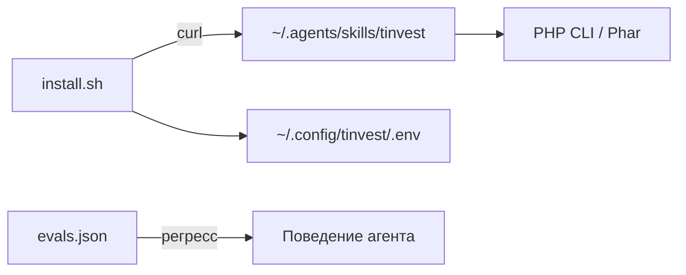

# EPIC-agent-packaging-and-behavior: Упаковка скилла, валидация поведения агента, ASCII-графики

## 0. Простое описание (Human Brief)

### Проблема простыми словами (Problem)
- Наш продукт трудно поставить обычному пользователю: нужен PHP + Composer + 4 пакета, нет `curl | bash`.
- `SKILL.md` слабее, чем у конкурента: нет «дисциплины режимов», ловушек полей JSON в `references/`, системы эвалов.
- Нет ASCII-графиков (`--chart`) в ответе агента — брайль-линий цены, баров структуры/дохода.

### Варианты или путь решения (Solution Sketch)
- Поставка как Phar/`composer`-baseline + `install.sh`, токены в `~/.config/`, авто-обновление без потери токенов.
- `references/json-fields.md` с ловушками полей (YTM=null, 0 у коэф., знаки breakdown, порог концентрации, исключение префов).
- `evals/evals.json` — регресс-тесты поведения агента по типовым запросам.
- ASCII-графики `--chart` (детерминированный рендер в CLI, поле `chart` в `--json`).

### Ожидаемый результат (Expected Result)
- Пользователь ставит агент одной командой; токены переживают обновление.
- Агент стабильно интерпретирует поля (меньше ошибок по `null`/`0`), поведение регрессионно тестируется эвалами.
- В ответе появляются наглядные графики цены/структуры/дохода.

## 1. Concept and Goal (Концепция и цель)

### Story (User Story)
> Как пользователь, я хочу поставить агент одной командой и доверять корректности его ответов, чтобы пользоваться им без технических навыков.

### Goal (Цель по SMART)
Довести «готовность продукта» (ГП) ключевых фич с ~4–5 до ~7–8: рабочий `install.sh`, `references/json-fields.md`, `evals/evals.json`, ASCII-графики. Срок: спринт 3 (1–2 недели).

## 2. Context and Scope (Контекст и границы)

- **Где делаем:** корень `t-invest-agent` (`install.sh`, `Makefile`, Phar-сборка), `skills/tinvest/{references,evals}/`, рендер графиков в `*-core`.
- **Границы (Out of Scope):**
    - Нативные установщики Windows (только WSL/Linux/macOS).
    - Полноценный web-UI (это `dashboard` эпик/скилл).

## 3. Requirements (Требования, MoSCoW)

### 🔴 Must Have (Блокирующие требования)
- [ ] `install.sh` (curl | bash), токены в `~/.config/tinvest/`, авто-обновление без потери токенов.
- [ ] `references/json-fields.md` с ловушками полей для всех команд.
- [ ] `evals/evals.json` — минимум 8–10 регресс-сценариев поведения агента.

### 🟡 Should Have (Важные требования)
- [ ] ASCII-графики `--chart` (брайль-линия цены, бары) в `--json`.

### 🟢 Could Have (Желательно)
- [ ] Phar-сборка CLI вместо `composer install` у пользователя.

### ⚫ Won't Have (Не в этот раз)
- [ ] Web-UI.
- [ ] Нативная установка Windows.

## 4. Solution Design (Техническое решение)

## 5. Implementation Plan (План реализации)

- [ ] TASK-agent-install-script — `install.sh` + авто-обновление
- [ ] TASK-agent-json-fields-references — `references/json-fields.md`
- [ ] TASK-agent-evals — система эвалов поведения агента
- [ ] TASK-agent-ascii-charts — рендер `--chart` в CLI
- [ ] TASK-agent-phar-build — Phar-сборка (Should/Could)

## 6. Definition of Done (Критерии приёмки эпика)

- [ ] Свежая ОС → `curl | bash install.sh` → работающий агент без ручного `composer`.
- [ ] `references/json-fields.md` покрывает все команды core.
- [ ] `evals` прогоняются и проходят.
- [ ] `--chart` отдаёт детерминированный ASCII-блок.

## 7. Release Notes and Deployment (Инструкция по релизу)

- [ ] Опубликовать `install.sh` в raw на GitHub.
- [ ] README: блок «Быстрая установка».

## 8. Risks and Dependencies (Риски и зависимости)

- Phar-сборка Symfony-приложения имеет подводные камни (autoload, env); оценить отдельно.
- Эвалы требуют фикстур/моков T-Invest API.

## 9. Sources (Источники)

- [ ] Конкурентный анализ: [`docs/COMPETITOR-ANALYSIS-t-invest-skill.md`](../../docs/COMPETITOR-ANALYSIS-t-invest-skill.md)
- [ ] Эталон: `install.sh`, `references/json-fields.md`, `evals/evals.json` у конкурента

## 10. Comments (Комментарии)

Эпик соответствует «Спринту 3 — Упаковка и поведение».

## Change History (История изменений)

| Дата | Автор (роль) | Изменение |
| :--- | :--- | :--- |
| 2026-07-04 | Владелец проекта (pi) | Создание эпика |
